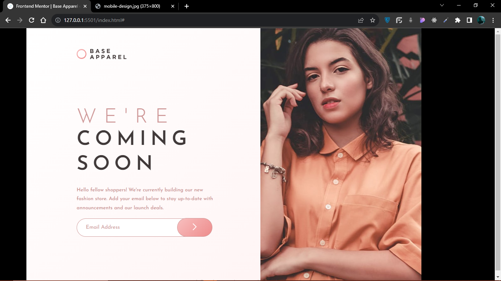
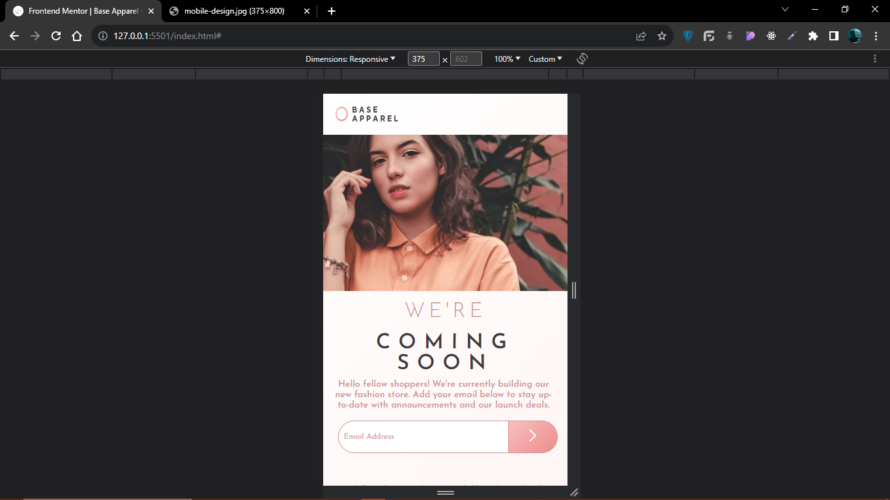
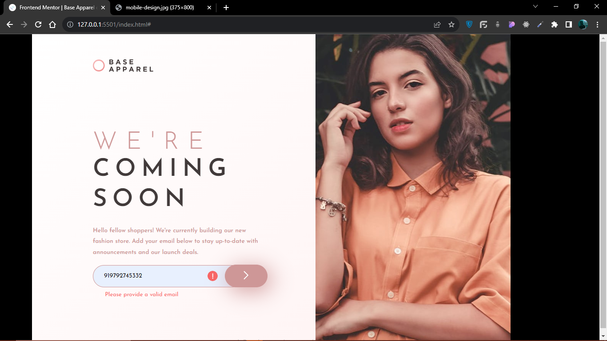

# Frontend Mentor - Base Apparel coming soon page solution

This is a solution to the [Base Apparel coming soon page challenge on Frontend Mentor](https://www.frontendmentor.io/challenges/base-apparel-coming-soon-page-5d46b47f8db8a7063f9331a0). Frontend Mentor challenges help you improve your coding skills by building realistic projects.

### The challenge

Users should be able to:

- View the optimal layout for the site depending on their device's screen size
- See hover states for all interactive elements on the page
- Receive an error message when the `form` is submitted if:
  - The `input` field is empty
  - The email address is not formatted correctly

### Screenshot

### Links

- Solution URL: [https://github.com/Thebeast01/Base-apparel-coming-soon.git]
- Live Site URL: [https://thebeast01.github.io/Base-apparel-coming-soon/]

### What I learned

Through this problem I was able to learn about Email validation using javascript, It was a great experience and I am happy that I was able to learn something new through this project.

## Author

- Frontend Mentor - [@Thebeast01](https://www.frontendmentor.io/profile/Thebeast01)
- LinkedIn - [@Mohammad Saif](https://www.linkedin.com/in/mohammad-saif-bca)
